# CESEA Sistemas — website

Multi-page marketing site for a Spanish health-tech company that sells clinical software, AI services and custom development to dental clinics, care homes and medical centres. Built with no bundler and no build step — React in the browser, compiled on load — because the site has to deploy as plain files over SFTP to shared hosting.

**Live:** https://sistemascsa.com

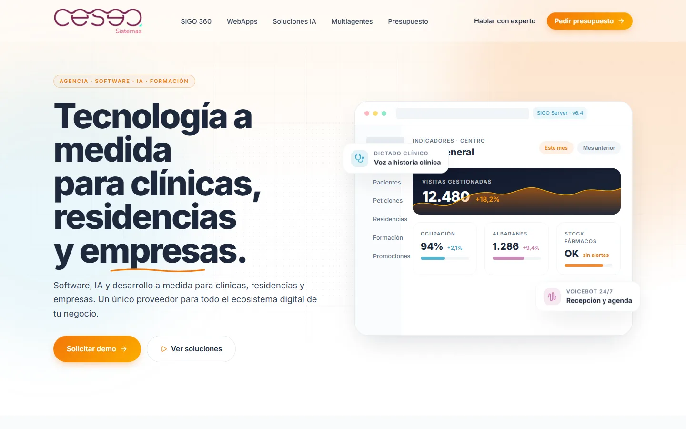

---

## What it is

CESEA Sistemas is the software arm of a Spanish care group. It sells five things at once — an ERP/CRM for clinics and care homes (SIGO 360), custom web apps, applied AI, coordinated AI agents, and websites — to buyers who are clinic owners, not technologists. The site had to price that catalogue honestly, explain the AI without hand-waving, and turn a curious visitor into a quote sitting in the sales rep's WhatsApp.

I designed and built the front end: the page architecture, the design system, the scroll-driven landing for the voice assistant, the quote builder, the structured-data layer, and the deployment pipeline that ships it.

The constraint that shaped everything: **no build step**. The client's hosting is a plain Apache box, deployment is an SFTP mirror from GitHub Actions, and nobody on their side runs `npm`. So the site is static HTML that loads React 18, Babel standalone and Tailwind from a CDN, with shared components registered on `window` and composed per page. It is not what I would pick for a product; it is the right call for a marketing site that a non-technical team has to keep alive for years.

## Screenshots

<table>
  <tr>
    <td width="50%">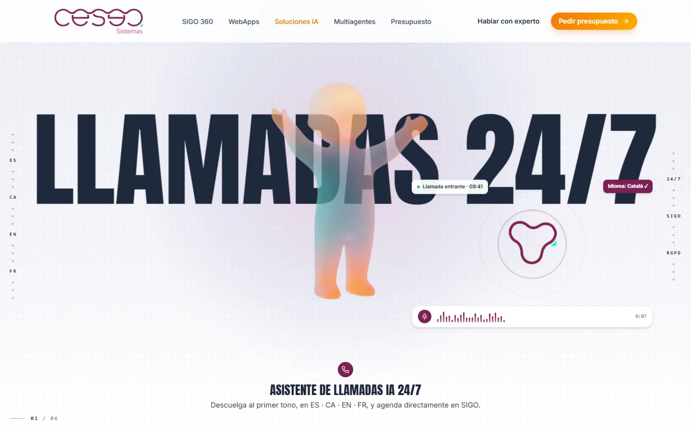 <b>AI landing · scroll hero.</b> The character stays pinned while the display word rotates through the six services in 3D; each chapter swaps its pose and floats in the matching example.</td>
    <td width="50%">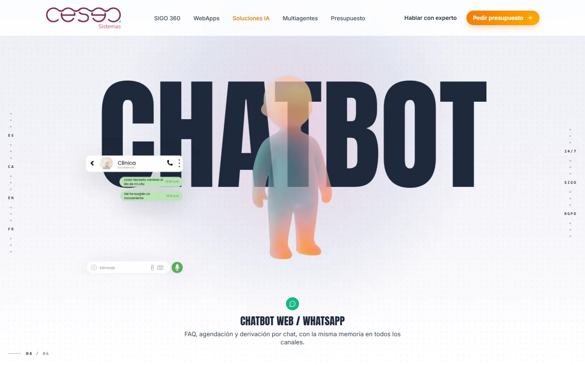 <b>Chapter four.</b> The creative is an animated WebP with an alpha channel, so the example floats free instead of sitting in a box.</td>
  </tr>
  <tr>
    <td width="50%">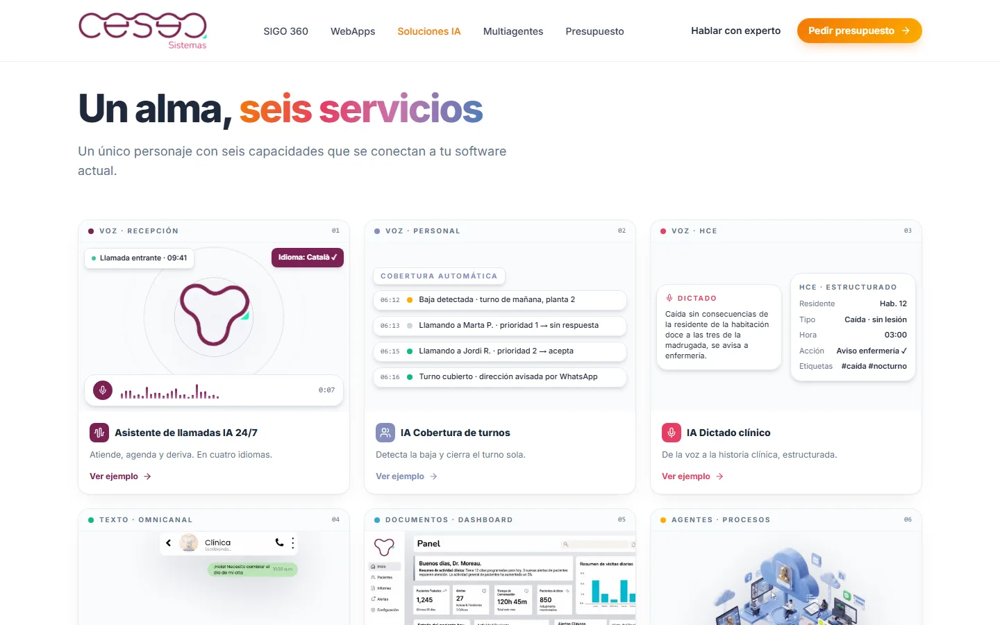 <b>Six services.</b> Below the hero, the same examples as a grid — each one opens full size in a modal, and deep-links via <code>?ejemplo=</code>.</td>
    <td width="50%">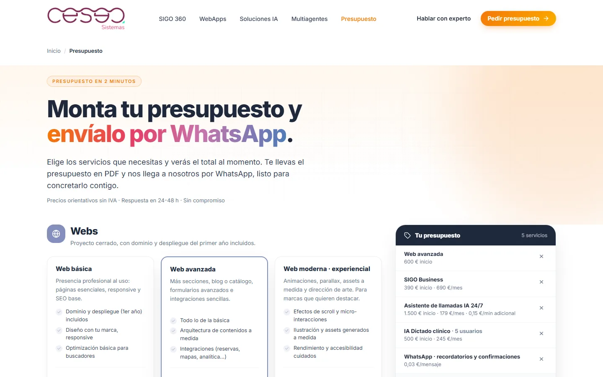 <b>Quote builder.</b> The full catalogue with published prices; the basket follows the visitor across pages and splits the total into one-off, monthly and usage-based.</td>
  </tr>
  <tr>
    <td width="50%">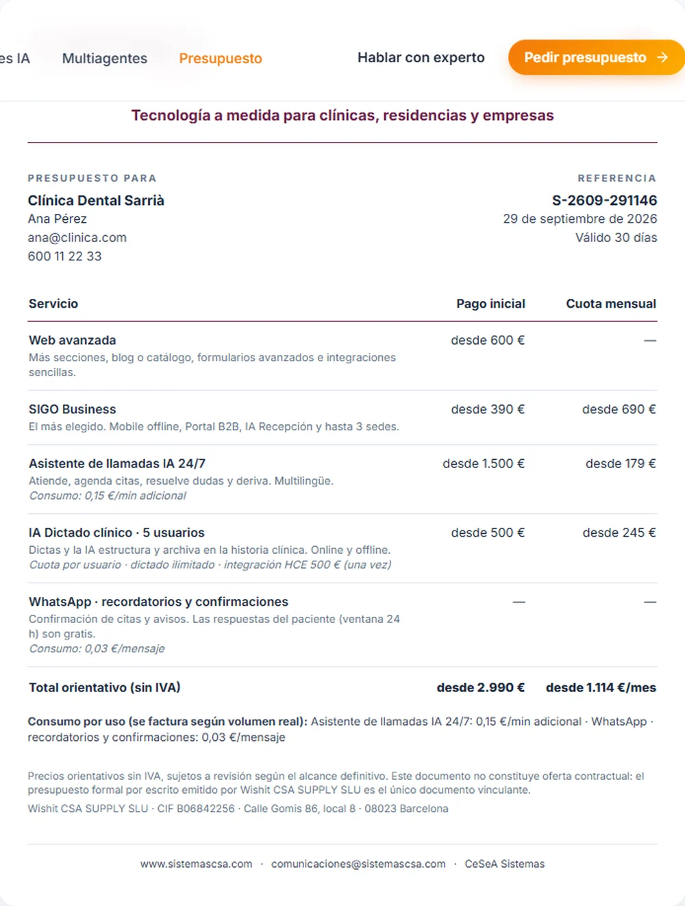 <b>The quote itself.</b> Rendered live on the company's own letterhead and printed as a single exact A4 — same document the client keeps and the rep receives.</td>
    <td width="50%">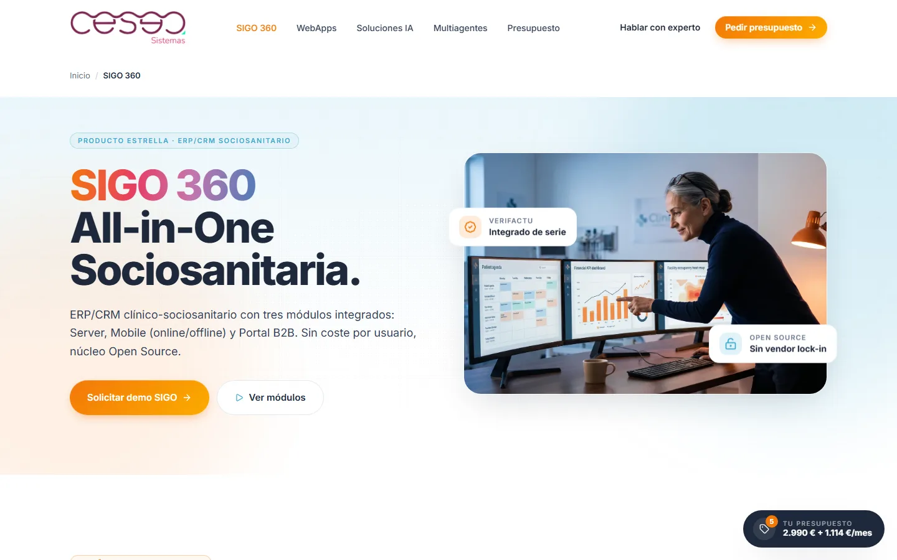 <b>SIGO 360.</b> The ERP/CRM product page: three modules, add-ons, integrations and the FHIR/VeriFactu compliance story.</td>
  </tr>
  <tr>
    <td width="50%">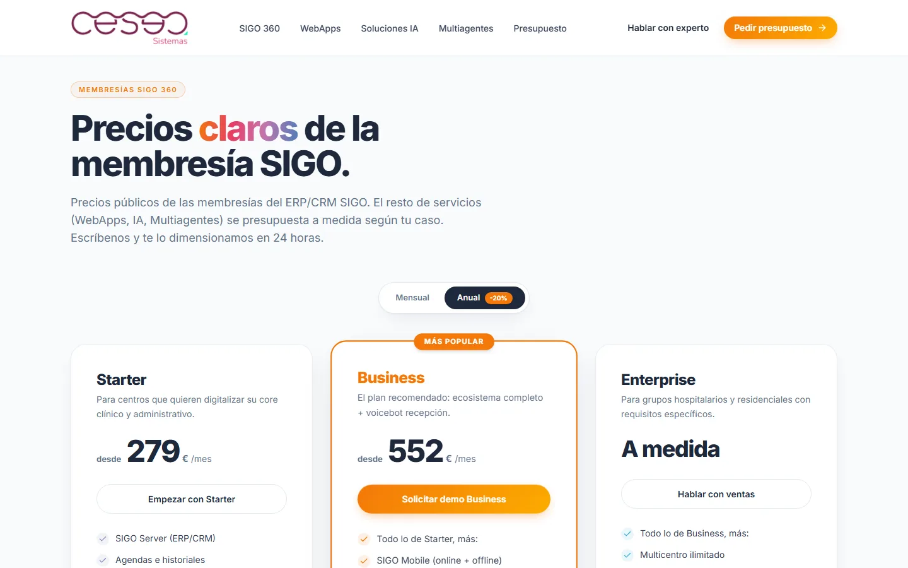 <b>Pricing.</b> Monthly/annual toggle, three tiers, and everything outside the membership stated as quoted-to-scope rather than hidden.</td>
    <td width="50%">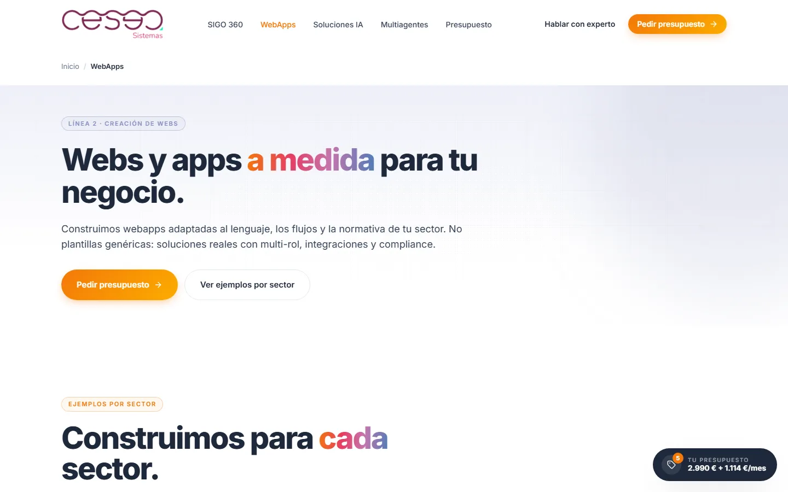 <b>Custom web apps.</b> Sold through a real delivered project rather than a feature list.</td>
  </tr>
  <tr>
    <td width="50%">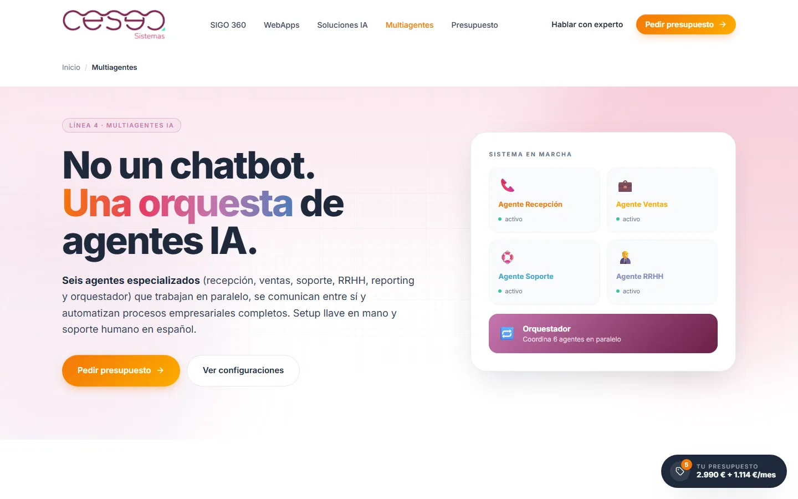 <b>Multi-agent systems.</b> Six specialised agents and an orchestrator, framed for an owner who has never bought AI before.</td>
    <td width="50%">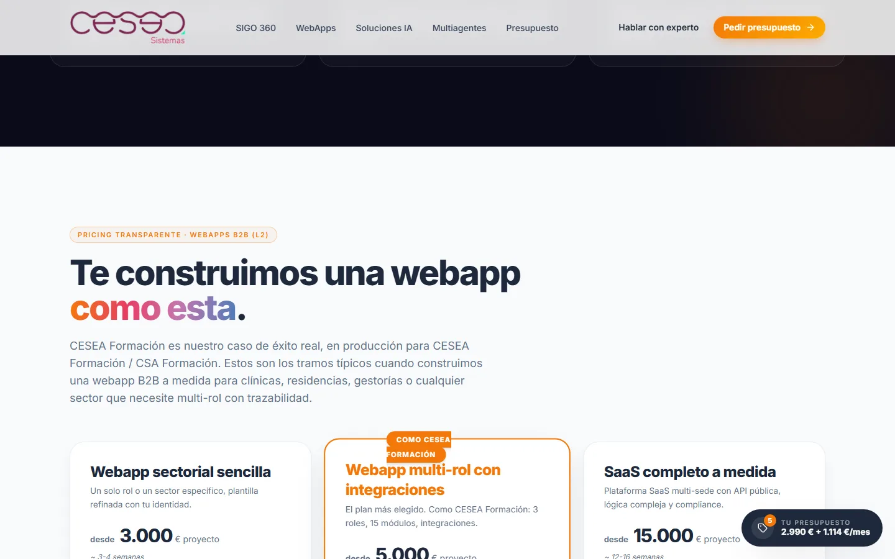 <b>Training platform.</b> A delivered LMS used as the proof for the custom-development line.</td>
  </tr>
</table>

## Stack

| Layer | Choice |
|---|---|
| Runtime | React 18 + ReactDOM, loaded from CDN |
| Compilation | Babel standalone — JSX compiled in the browser, no bundler |
| Styling | Tailwind CSS via CDN, with the brand palette declared in an inline `tailwind.config` |
| Type | Inter (body), Anton (display, for the scroll hero) |
| Icons | Lucide, rendered through a thin React wrapper instead of DOM mutation |
| Media | Animated WebP with alpha for the product examples; WebP/JPEG with `<picture>` elsewhere |
| Backend | None on the site. The contact form posts to a Supabase Edge Function; the quote builder goes out through WhatsApp |
| Delivery | GitHub Actions → `lftp` SFTP mirror → Apache shared hosting, behind a CDN |

## Architecture

**Pages, not routes.** Each page is a standalone HTML file with its own `<head>` (canonical, Open Graph, JSON-LD) and a single `#root`. Shared pieces — navigation, footer, breadcrumb, buttons, section primitives — live in `src/shared/` and `src/primitives.jsx` and register themselves on `window`; the page's own app file composes them. Load order in the HTML is the dependency graph. Crude, but it means a new page is one file plus a script tag, and the client's team can copy an existing page and edit it.

**Icons without the flicker.** Lucide's `createIcons()` rewrites `<i>` into `<svg>` behind React's back, so icons vanish whenever a parent re-renders — an accordion, a pricing toggle, a tab. Instead the wrapper reads `lucide.icons[Name]` and renders the SVG children as React elements, so React keeps control and nothing flashes.

**The scroll hero.** The AI landing pins a stage for the height of eight chapters and drives everything from one `requestAnimationFrame` loop reading `getBoundingClientRect`: the display word rotates out in 3D while the next rotates in, the character cross-fades between six poses, the floating example swaps sides, and on the last chapter the word drops away. No animation library. Scroll progress is eased per chapter so each word holds still while you read it and only moves during the transition. `prefers-reduced-motion` drops the rotation and leaves a plain cross-fade.

**Legibility over ornament.** The character is translucent by design so the display type reads through it. An early version put a blurred glow behind it — which, in paint order, landed *in front of* the word and washed it out. Removing that one element fixed a bug that looked like an asset problem and was a layering problem.

## The quote builder

The sales ask was blunt: let a visitor assemble what they want and drop it in the rep's WhatsApp, ready to negotiate.

- **One source of prices.** The catalogue lives in a single module, mirroring the public rate card: one-off, monthly, usage-based, and quantity where it applies. Totals never merge those three — usage is listed, never summed, because it depends on real volume nobody can predict at quote time.
- **Mutually exclusive families.** Picking a second ERP tier replaces the first instead of stacking two memberships.
- **Basket that follows you.** State sits in `localStorage` behind a custom event, so it survives page loads and a second tab, and a floating summary rides along on every page.
- **Two exits, one document.** The quote renders live on the company's real letterhead — both logos, claim line and contact footer — and prints as an exact single A4. The same data is formatted as a WhatsApp message with the breakdown and the client's details, opened through a `wa.me` deep link.
- **Printing, done properly.** Hiding the page with `visibility: hidden` still reserves its layout, which produced an eight-page PDF with seven blanks. The document is rendered a second time through a React portal into a node outside `#root`; print CSS hides the app and shows only that copy. One page, every time.

## SEO & structured data

Each page emits its own JSON-LD — `Organization`, `Service` per line, `BreadcrumbList`, `FAQPage` where a real FAQ exists — plus canonical, Open Graph and Twitter tags. Structured data is only declared when the page actually shows it: when the client stripped the FAQ off the AI page, the `FAQPage` block went with it rather than staying behind as decoration.

Because the body is client-rendered, every page also carries an off-screen static block summarising its content and prices, so a crawler that does not execute JavaScript still gets the substance. The site ships `llms.txt` and `llms-full.txt` for AI answer engines, a hand-kept `sitemap.xml`, and a public glossary and comparison page aimed at the questions buyers actually type.

## Security & privacy

No application backend ships with the site, which removes most of the surface. What remains is handled deliberately:

- **Headers and CSP.** Every page declares `Content-Security-Policy` (sources pinned to self plus the three CDNs it genuinely uses), `X-Content-Type-Options`, `Referrer-Policy` and `Permissions-Policy` denying camera, microphone, geolocation and payment. Apache adds `X-Frame-Options: DENY` and long-lived caching for static assets, and blocks the internal directories.
- **No personal data at rest in the quote flow.** The builder stores only the chosen services in the visitor's own browser. Their name and contact details are typed, put straight into the WhatsApp message, and never sent anywhere else — there is no endpoint to breach because there is no endpoint.
- **Analytics without cookies.** Traffic is measured through a self-hosted, cookieless endpoint; no third-party trackers, no consent theatre.
- **Screenshots in this repository** use invented client data.

Known and tracked: the CSP still allows `'unsafe-inline'` and `'unsafe-eval'`, which in-browser Babel requires. It is the price of the no-build-step constraint, and the reason this approach stays on marketing pages and nowhere near an authenticated product.

## Performance & accessibility

Compiling JSX in the browser costs a few hundred milliseconds on first paint, so the pages are kept small and the static fallback carries the content meanwhile. Images are WebP with explicit dimensions; the heaviest creative — an animated example that arrived as a 36 MB GIF — ships as a 2 MB animated WebP with its transparency intact. Motion honours `prefers-reduced-motion` throughout, focus states are visible, the scroll hero carries a real `<h1>` for screen readers behind the display type, and every interactive element in the quote builder is a labelled control.

---

Designed and built by **Daniel Brosed** — developer and security auditor.
[danielbrosed.com](https://danielbrosed.com) · [LinkedIn](https://www.linkedin.com/in/danielbrosed/)

The site and its content are © CESEA Sistemas / Wishit CSA SUPPLY SLU. This repository documents the build as a portfolio case study; the screenshots are of the production site and the application source is not included. See [`LICENSE`](LICENSE).
